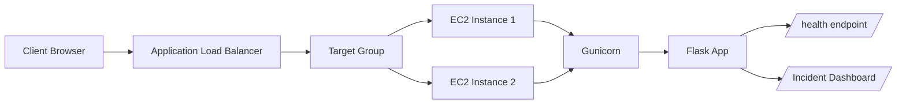
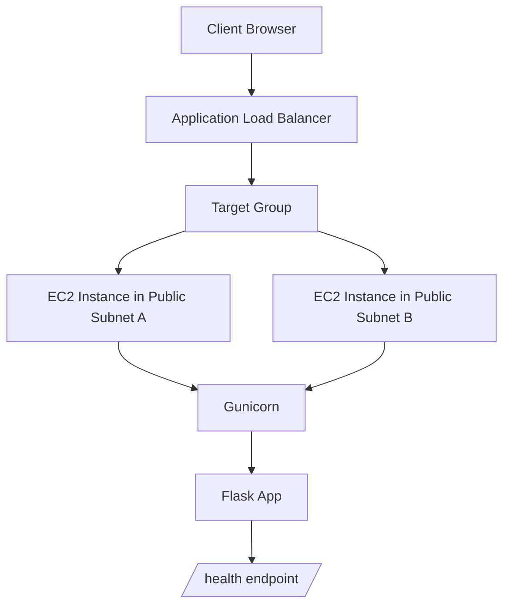

# AWS-Project
Decision accelerator for IT-Ops
# Incident Management App

A modern Flask-based incident management dashboard deployed on AWS with Terraform. The application provides an interactive UI to create, track, and update incidents, along with a health endpoint for monitoring.

## 1. Overview

This project contains:
- A Flask web application with a responsive incident dashboard
- An in-memory incident store for demo/testing purposes
- Terraform infrastructure to deploy the app on AWS
- An Application Load Balancer and Auto Scaling Group for high availability and scalability
- 


## 2. Architecture



## 2. Architecture Diagram



## 3. Application Components

### Flask Application
- File: `incident-management-app/app.py`
- Purpose:
  - Serves the incident dashboard UI
  - Exposes `/health` for monitoring
  - Provides REST endpoints for incident management:
    - `GET /api/incidents`
    - `POST /api/incidents`
    - `PATCH /api/incidents/<id>`

### Frontend
- Built with Flask-rendered HTML and embedded CSS/JavaScript
- Provides:
  - Incident creation form
  - Incident status cards
  - Status update buttons
  - Real-time dashboard refresh via API calls

### Backend
- Flask handles the web routes and JSON responses
- Gunicorn is used as the production WSGI server
- Nginx proxies traffic from port 80 to the Flask application running on port 8000

## 4. AWS Infrastructure Resources

The Terraform configuration provisions the following AWS resources:

### Networking
- Virtual Private Cloud (VPC)
  - CIDR: `10.0.0.0/16`
- Internet Gateway
  - Enables public internet access for the application
- Public Subnets
  - `10.0.1.0/24` in `us-east-1a`
  - `10.0.2.0/24` in `us-east-1b`

### Security
- Application Load Balancer Security Group
  - Allows inbound HTTP on port `80`
- Application Security Group
  - Allows inbound SSH on port `22` from your configured CIDR
  - Allows inbound traffic on port `8000` from the ALB
- This design keeps the app instances private from direct internet traffic while the ALB remains publicly accessible

### Load Balancing
- Application Load Balancer (ALB)
  - Public-facing
  - Receives traffic on port `80`
  - Forwards requests to the target group

### Target Group
- Health check path: `/health`
- Port: `8000`
- Protocol: `HTTP`

### Auto Scaling Group
- Desired capacity: `2`
- Minimum size: `1`
- Maximum size: `3`
- Launches EC2 instances from a launch template
- Automatically replaces unhealthy instances

### Launch Template
- Uses Ubuntu 22.04 AMI
- Installs:
  - Python
  - pip
  - venv
  - git
  - Nginx
  - Gunicorn
- Clones the application repository from GitHub
- Starts the Flask app as a systemd service

### EC2 Instances
- Run the Flask app behind Gunicorn
- Expose the app internally on port `8000`
- Are managed by the Auto Scaling Group

## 5. Project Structure

```text
AWS-Project/
├── incident-management-app/
│   ├── app.py
│   ├── requirements.txt
│   └── terraform/
│       ├── main.tf
│       ├── variables.tf
│       ├── outputs.tf
│       └── user-data.sh.tftpl
└── README.md
```

## 6. Local Development

### Prerequisites
- Python 3.9+
- pip
- Virtual environment tool

### Run Locally
```bash
cd incident-management-app
python -m venv .venv
source .venv/bin/activate
pip install -r requirements.txt
python app.py
```

### Access the app
- Dashboard: `http://127.0.0.1:8000/`
- Health endpoint: `http://127.0.0.1:8000/health`

## 7. Terraform Deployment

### Prerequisites
- AWS account
- AWS CLI configured with credentials
- Existing EC2 key pair name (optional)
- GitHub repository URL containing the app code

### Deploy
```bash
cd incident-management-app/terraform
terraform init
terraform apply -var "repo_url=https://github.com/komal133/AWS-Project.git"
```

### Outputs
Terraform will print:
- `load_balancer_dns_name`
- `app_url`

### Load Balancer DNS
After deployment, get the public endpoint from Terraform:

```bash
terraform output load_balancer_dns_name
```

Then open the app in your browser:

```text
http://<load-balancer-dns-name>/
```

You can also use the full URL from the `app_url` output.

## 8. Runtime Behavior

### Application Startup
- The app starts with `gunicorn --bind 0.0.0.0:8000 app:app`
- Nginx serves traffic on port `80` and forwards requests to port `8000`

### Health Monitoring
- `/health` returns a JSON response:
```json
{
  "status": "ok"
}
```

- app_url                = "http://incident-management-app-alb-443524795.us-east-1.elb.amazonaws.com/" -> null
  - load_balancer_dns_name = "incident-management-app-alb-443524795.us-east-1.elb.amazonaws.com" -> null


## 9. Notes and Limitations

- Incidents are currently stored in memory and will be lost if the app restarts.
- This setup is suitable for demos and learning.
- For production, consider:
  - Persistent storage with Amazon RDS or DynamoDB
  - HTTPS with ACM + Route 53
  - Secrets management
  - CI/CD automation

## 10. Next Improvements

Recommended enhancements:
- Add HTTPS using ACM and Route 53
- Use a database instead of in-memory storage
- Add CI/CD using GitHub Actions
- Add monitoring using CloudWatch and alarms

